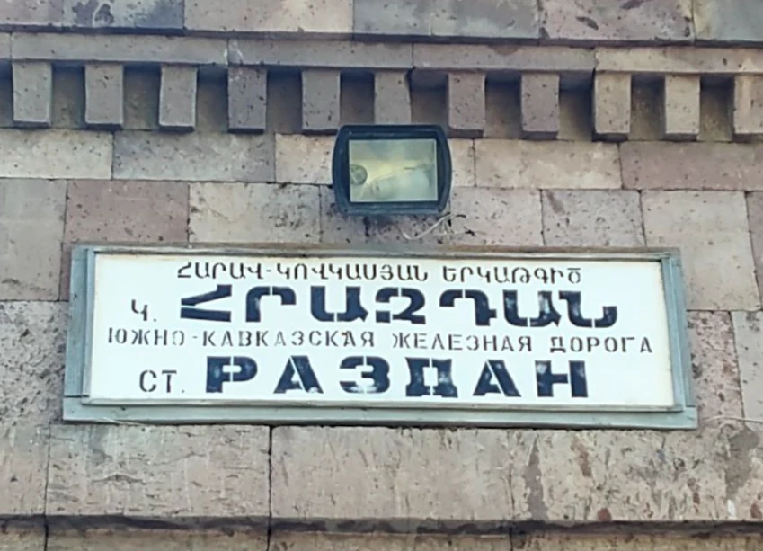

# Why JavaScript on a language site

It may seem strange to find a programming section on a site about Armenian words and notes about Yerevan.

After leaving my accounting career, I chose to retrain as a frontend developer. After a Practicum course I keep writing training programs in JavaScript, uploading them to git and exploring the intricacies of HTML and CSS.

At the same time we started learning Armenian. The alphabet was an obstacle: it's larger and more complex than the Russian one, uppercase and lowercase letters differ, and there are no simple self-study guides that link picture, Armenian word, meaning and pronunciation.

While walking around the city we noticed many signs show Armenian words alongside Russian or Latin letters, which makes the alphabet easier to absorb.

So the idea was born to make a simple HTML/CSS/JS project for newcomers like us to learn Armenian words and phrases. That's why our blog includes a section on JavaScript basics—after all, it's a language too!
